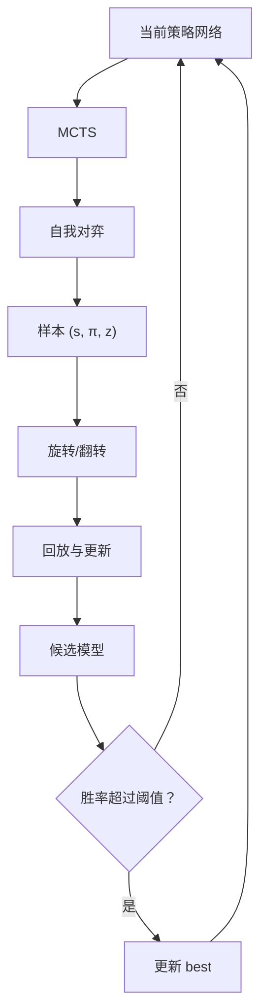
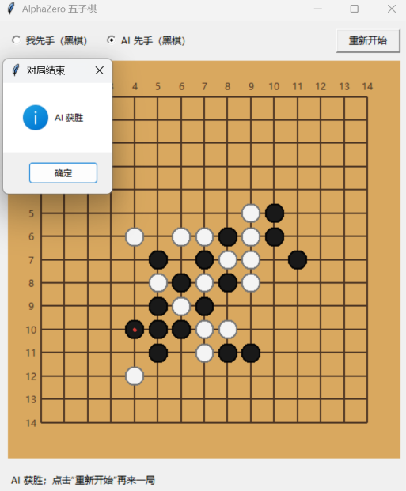

# AlphaZero Gomoku

一个面向学习与实验的 AlphaZero 五子棋实现。项目只依赖游戏规则，从随机初始化的策略价值网络出发，通过**自我对弈、蒙特卡洛树搜索（MCTS）和深度强化学习**迭代提升棋力，不使用人类棋谱或手工局面评估函数。

仓库默认训练一个 **6 × 6 棋盘、4 子连线获胜**的智能体，同时支持通过命令行调整棋盘大小、获胜条件、网络规模和 MCTS 模拟次数。项目还包含命令行与 Tkinter 图形界面，可直接加载训练好的模型进行人机对弈。

> 本项目是对 AlphaGo Zero / AlphaZero 核心思想的教学型复现，并非 DeepMind 原始系统的完整复刻。默认网络和搜索规模均经过大幅缩小，适合在个人计算机上理解算法与开展实验。

## 核心思路

在一次自我对弈中，每个局面保存训练样本：

```text
(s, π, z)
```

- `s`：当前玩家视角下的棋盘状态；
- `π`：MCTS 根节点访问次数形成的动作概率分布；
- `z`：对局结束后的胜负结果，取值为 `-1`、`0` 或 `1`。

网络同时预测策略 `p` 和局面价值 `v`，训练目标为：

$$
\mathcal{L}=(z-v)^2-\pi^\top\log p+c\lVert\theta\rVert^2
$$

其中第一项训练价值头，第二项训练策略头，最后一项是 L2 正则化。整体流程如下：

<div style="max-width: 780px; margin: 0 auto;">



</div>

实现上，训练始终使用**当前网络**生成自我对弈数据（参考AlphaZero），并定期让候选网络与 `best` 网络比赛；候选模型胜率严格超过阈值后才更新 `best`（保留AlphaGo Zero的记录最好模型的流程）。

## 实现特点

- **规则环境**：支持可配置棋盘边长和连子数的正方形五子棋棋盘；
- **状态表示**：4 个特征平面，分别表示当前玩家棋子、对手棋子、上一步落子和当前执棋方；
- **策略价值网络**：共享卷积层与残差塔，连接策略头和价值头；
- **神经网络引导的 MCTS**：使用策略先验进行探索，以价值头评估叶节点，不执行随机 rollout；
- **探索机制**：自我对弈时在 MCTS 概率中加入 Dirichlet 噪声；
- **数据增强**：利用棋盘旋转和镜像对称性，将每个样本扩展为 8 个样本；
- **自适应训练**：根据新旧策略的 KL 散度提前停止 epoch，并调整学习率倍率；
- **模型评估**：候选模型定期与历史最佳模型对弈，达到胜率门槛后晋升；
- **交互方式**：提供命令行和 Tkinter GUI 两种人机对弈界面。

## 项目结构

```text
.
├── requirements.txt              # python依赖包
├── game.py                       # 棋盘状态、胜负判断和对局控制
├── mcts_alphaZero_simple.py      # 简单串行 MCTS
├── mcts_alphaZero.py             # 批量叶节点 MCTS
├── policy_value_net.py           # PyTorch 残差策略价值网络
├── train.py                      # 单 GPU 训练（支持串行/批量 MCTS）
├── train_parallel.py             # 多 GPU 并行训练
├── human_play.py                 # 命令行人机对弈
├── gui_play.py                   # Tkinter 图形界面人机对弈
├── 6_6_4_train.ipynb             # 6 × 6、4 连子训练实验记录
├── 8_8_5_train.ipynb             # 8 × 8、5 连子训练实验记录
├── 15_15_5_train.ipynb           # 15 × 15、5 连子训练实验记录
├── 6_6_4_model/                  # 6 × 6、4 连子模型
├── 8_8_5_model/                  # 8 × 8、5 连子模型
├── 15_15_5_model/                # 15 × 15、5 连子模型
└── paper/
    ├── paper1_alphago.md         # AlphaGo 论文笔记
    ├── paper2_alphagoZero.md     # AlphaGo Zero 论文笔记
    └── paper3_alphaZero.md       # AlphaZero 论文笔记
```

## 环境准备

建议使用 Python 3.10 或更高版本。

```bash
pip install -r requirements.txt 
```

`requirements.txt` 中的 PyTorch 按照 CUDA 12.4 配置；使用其他 CUDA 版本时，请根据 [PyTorch 官方安装说明](https://pytorch.org/get-started/locally/) 安装与本机环境匹配的版本。

## 训练模型

项目包含三组由小到大的训练示例。下面的耗时来自实际实验，仅供参考；显卡利用率、CPU 性能和参数设置都会影响训练时间。

| 棋盘与规则 | 训练方式 | 实测硬件与耗时 | 实验记录 |
| --- | --- | --- | --- |
| 6 × 6，4 子连线 | 最简单的串行 MCTS | RTX 3050 Ti：约 6 小时 | [6_6_4_train.ipynb](6_6_4_train.ipynb) |
| 8 × 8，5 子连线 | 单 GPU 批量 MCTS | RTX 3050 Ti：约 5 小时；RTX 4090：约 3.5 小时 | [8_8_5_train.ipynb](8_8_5_train.ipynb) |
| 15 × 15，5 子连线 | 5 张 RTX 4090 多 GPU 并行训练 | 约 6 小时 | [15_15_5_train.ipynb](15_15_5_train.ipynb) |

### 模型规模

三组实验使用相同的双头残差网络结构，但棋盘越大，策略头和价值头的全连接层也会随之增大。参数量包含全部可训练参数，模型大小为仓库中 PyTorch `state_dict` 文件的实际大小：

| 棋盘与规则 | 特征通道数 | 残差块数 | 参数量 | 模型文件大小 |
| --- | ---: | ---: | ---: | ---: |
| 6 × 6，4 子连线 | 64 | 2 | 165,489（约 16.5 万） | 约 0.65 MiB |
| 8 × 8，5 子连线 | 64 | 6 | 479,821（约 48.0 万） | 约 1.87 MiB |
| 15 × 15，5 子连线 | 128 | 8 | 2,629,618（约 263 万） | 约 10.09 MiB |

模型文件只包含网络权重，不包含优化器状态、经验回放池或 MCTS 搜索树，因此训练时的显存和内存占用会明显高于上表中的文件大小。

### 6 × 6，4 子连线：串行 MCTS

这是最简单、最适合第一次理解完整训练流程的配置。`train.py` 默认使用 `mcts_alphaZero_simple.py` 中的串行 MCTS：

```bash
python train.py \
  --device cuda \
  --current-model 6_6_4_model/current_policy.model \
  --best-model 6_6_4_model/best_policy.model
```

除设备和模型保存路径外，其余均使用默认参数：6 × 6 棋盘、4 子连线、每步 500 次 MCTS 模拟、64 个特征通道和 2 个残差块，共训练 1200 局。RTX 3050 Ti 实测约需 6 小时，完整实验见 [6_6_4_train.ipynb](6_6_4_train.ipynb)。

每 50 个训练批次会：

1. 将候选网络保存为 `current_policy.model`；
2. 让候选网络与当前 `best` 网络对弈 20 局；
3. 当候选网络胜率严格超过 55% 时，保存新的 `best_policy.model`。

继续训练已有模型：

```bash
python train.py \
  --init-model 6_6_4_model/best_policy.model \
  --current-model 6_6_4_model/current_policy.model \
  --best-model 6_6_4_model/best_policy.model \
  --device cuda
```

### 8 × 8，5 子连线：批量 MCTS

棋盘扩大后，使用 `mcts_alphaZero.py` 中的批量 MCTS：同一步在一棵树上选择至多 `B` 个不同的叶节点，通过 Virtual Loss 避免重复选择，再用一次网络前向批量完成评估。实验参数为每步 600 次模拟、批量叶节点数 16、64 个特征通道和 6 个残差块。

RTX 3050 Ti 实测约需 5 小时，RTX 4090 实测约需 3.5 小时。可直接打开 [8_8_5_train.ipynb](8_8_5_train.ipynb) 运行，其中已将 `is_MCTS_simple` 设为 `False`，并配置好模型保存路径。

### 15 × 15，5 子连线：5 GPU 并行训练

标准大小棋盘使用 `train_parallel.py`。第一个设备专门运行 Learner，其余四个设备各运行一个批量 MCTS Self-play Actor；5 张 RTX 4090 实测约需 6 小时。该版本删除了中间对战评估最好模型的环节（AlphaGo Zero中的环节，在AlphaZero中也删去了）。示例命令如下：

```bash
python train_parallel.py \
  --devices cuda:0,cuda:1,cuda:2,cuda:3,cuda:4 \
  --board-size 15 \
  --n-in-row 5 \
  --playouts 800 \
  --leaf-batch-size 16 \
  --virtual-loss 1.0 \
  --channels 128 \
  --num-blocks 8 \
  --latest-model 15_15_5_model/current_policy.model
```

设备布局为：

```text
cuda:0  Learner
cuda:1  Self-play Actor 1
cuda:2  Self-play Actor 2
cuda:3  Self-play Actor 3
cuda:4  Self-play Actor 4
```

`--devices` 也支持非连续 GPU 编号，列表中的第一个设备始终是 Learner：

```bash
python train_parallel.py --devices cuda:0,cuda:2,cuda:4,cuda:6
```

Learner 每收到一局会把数据旋转/翻转后加入经验池，并默认执行一次随机采样更新。
可用 `--train-steps-per-game` 调整更新与新对局的比例，用
`--warmup-samples` 控制开始训练前的最小样本量。每
`--publish-freq` 次更新，Learner 会原子发布一次 `latest`；Actor
只在一局结束后加载新版本，因此不会在同一局中途切换网络。

`--leaf-batch-size` 即批量叶节点数 `B`。第一次扩展根节点、临近终局或当前
搜索前沿不足时，实际前向批量可能小于 `B`。同一批次中已选择的叶节点会被
标记为在途，Virtual Loss 同时降低对应分支的临时 PUCT 分数；评估完成后
临时统计量会全部撤销，再写入真实访问次数和价值。

完整参数可通过以下命令查看：

```bash
python train.py --help
python train_parallel.py --help
```

## 快速体验

仓库附带了三个规格的训练模型，可以直接通过 GUI 进行人机对弈。

### GUI 人机对弈

体验 6 × 6、4 子连线模型：

```bash
python gui_play.py 6_6_4_model/best_policy.model --human-first
```

不传 `--human-first` 时 AI 先手，也可以在窗口内切换先手并重新开始。可用 `--playouts` 调整 AI 每步的 MCTS 模拟次数；数值越大通常思考越充分，但落子越慢：

```bash
python gui_play.py 6_6_4_model/best_policy.model --playouts 800
```

体验更大棋盘时，需要传入与模型匹配的参数：

```bash
# 8 × 8，5 子连线
python gui_play.py 8_8_5_model/best_policy.model \
  --device cuda --board-size 8 --n-in-row 5 \
  --playouts 600 --channels 64 --num-blocks 6

# 15 × 15，5 子连线
python gui_play.py 15_15_5_model/current_policy.model \
  --device cuda --board-size 15 --n-in-row 5 \
  --playouts 800 --channels 128 --num-blocks 8
```

​<div align=center>

</div>
<div align=center>图1 gui对战效果</div>


> 加载模型时，`--board-size`、`--channels` 和 `--num-blocks` 必须与训练模型完全一致，否则 PyTorch 会报告参数尺寸不匹配。


### 命令行人机对弈

```bash
python human_play.py 6_6_4_model/best_policy.model --human-first --device cpu
```

轮到人类时输入 `行,列`，例如：

```text
Your move: 2,3
```

GUI 与命令行参数可通过以下命令查看：

```bash
python gui_play.py --help
python human_play.py --help
```

## 参考论文

1. Silver, D., Huang, A., Maddison, C., et al. **Mastering the game of Go with deep neural networks and tree search**. *Nature* 529, 484–489 (2016). 仓库笔记：[paper1_alphago.md](paper/paper1_alphago.md)。
2. Silver, D., Schrittwieser, J., Simonyan, K., et al. **Mastering the game of Go without human knowledge**. *Nature* 550, 354–359 (2017). 仓库笔记：[paper2_alphagoZero.md](paper/paper2_alphagoZero.md)。
3. Silver, D., Hubert, T., Schrittwieser, J., et al. **A general reinforcement learning algorithm that masters chess, shogi, and Go through self-play**. *Science* 362(6419), 1140–1144 (2018). 仓库笔记：[paper3_alphaZero.md](paper/paper3_alphaZero.md)。
