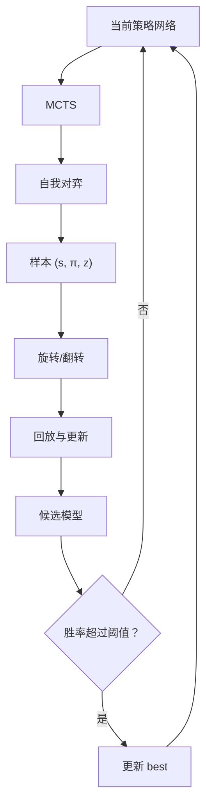

# AlphaZero Gomoku

一个面向学习与实验的 AlphaZero 五子棋实现。项目只依赖游戏规则，从随机初始化的策略价值网络出发，通过**自我对弈、蒙特卡洛树搜索（MCTS）和深度强化学习**迭代提升棋力，不使用人类棋谱或手工局面评估函数。

仓库默认训练一个 **6 × 6 棋盘、4 子连线获胜**的智能体，同时支持通过命令行调整棋盘大小、获胜条件、网络规模和 MCTS 模拟次数。项目还包含命令行与 Tkinter 图形界面，可直接加载训练好的模型进行人机对弈。

> 本项目是对 AlphaGo Zero / AlphaZero 核心思想的教学型复现，并非 DeepMind 原始系统的完整复刻。默认网络和搜索规模均经过大幅缩小，适合在个人计算机上理解算法与开展实验。

## 核心思路

在一次自我对弈中，每个局面保存训练样本：

```text
(s, π, z)
```

- `s`：当前玩家视角下的棋盘状态；
- `π`：MCTS 根节点访问次数形成的动作概率分布；
- `z`：对局结束后的胜负结果，取值为 `-1`、`0` 或 `1`。

网络同时预测策略 `p` 和局面价值 `v`，训练目标为：

$$
\mathcal{L}=(z-v)^2-\pi^\top\log p+c\lVert\theta\rVert^2
$$

其中第一项训练价值头，第二项训练策略头，最后一项是 L2 正则化。整体流程如下：

<div style="max-width: 780px; margin: 0 auto;">



</div>

实现上，训练始终使用**当前网络**生成自我对弈数据（参考AlphaZero），并定期让候选网络与 `best` 网络比赛；候选模型胜率严格超过阈值后才更新 `best`（保留AlphaGo Zero的记录最好模型的流程）。

## 实现特点

- **规则环境**：支持可配置棋盘边长和连子数的正方形五子棋棋盘；
- **状态表示**：4 个特征平面，分别表示当前玩家棋子、对手棋子、上一步落子和当前执棋方；
- **策略价值网络**：共享卷积层与残差塔，连接策略头和价值头；
- **神经网络引导的 MCTS**：使用策略先验进行探索，以价值头评估叶节点，不执行随机 rollout；
- **探索机制**：自我对弈时在 MCTS 概率中加入 Dirichlet 噪声；
- **数据增强**：利用棋盘旋转和镜像对称性，将每个样本扩展为 8 个样本；
- **自适应训练**：根据新旧策略的 KL 散度提前停止 epoch，并调整学习率倍率；
- **模型评估**：候选模型定期与历史最佳模型对弈，达到胜率门槛后晋升；
- **交互方式**：提供命令行和 Tkinter GUI 两种人机对弈界面。

## 项目结构

```text
.
├── requirements.txt              # python依赖包
├── game.py                       # 棋盘状态、胜负判断和对局控制
├── mcts_alphaZero.py             # 策略价值网络引导的 MCTS
├── policy_value_net.py           # PyTorch 残差策略价值网络
├── train.py                      # 自我对弈、数据增强、训练与模型评估
├── human_play.py                 # 命令行人机对弈
├── gui_play.py                   # Tkinter 图形界面人机对弈
├── 6_6_4_train.ipynb             # 6 × 6、4 连子训练实验记录
├── 6_6_4_model/
│   ├── current_policy.model      # 已训练的候选模型
│   └── best_policy.model         # 已训练的最佳模型
└── paper/
    ├── paper1_alphago.md         # AlphaGo 论文笔记
    ├── paper2_alphagoZero.md     # AlphaGo Zero 论文笔记
    └── paper3_alphaZero.md       # AlphaZero 论文笔记
```

## 环境准备

建议使用 Python 3.10 或更高版本。

```bash
pip install -r requirements.txt 
```

默认是按照cuda 12.4，其他版本请根据 [PyTorch 官方安装说明](https://pytorch.org/get-started/locally/) 安装与本机 CUDA 环境匹配的 PyTorch。

## 快速体验

仓库附带的模型配置为：

| 参数 | 值 |
| --- | ---: |
| 棋盘 | 6 × 6 |
| 获胜条件 | 4 子连线 |
| 特征通道数 | 64 |
| 残差块数 | 2 |

### GUI 人机对弈

```bash
python gui_play.py 6_6_4_model/best_policy.model --human-first
```

不传 `--human-first` 时 AI 先手，也可以在窗口内切换先手并重新开始。可用 `--playouts` 调整 AI 每步的 MCTS 模拟次数；数值越大通常思考越充分，但落子越慢：

```bash
python gui_play.py 6_6_4_model/best_policy.model --playouts 800
```

### 命令行人机对弈

```bash
python human_play.py 6_6_4_model/best_policy.model --human-first
```

轮到人类时输入 `行,列`，例如：

```text
Your move: 2,3
```

> 加载模型时，`--board-size`、`--channels` 和 `--num-blocks` 必须与训练模型完全一致，否则 PyTorch 会报告参数尺寸不匹配。

## 训练模型

使用默认配置开始训练：

```bash
python train.py
```

默认配置包括 6 × 6 棋盘、4 子连线、每步 500 次 MCTS 模拟、64 个特征通道和 2 个残差块。每 50 个训练批次会：

1. 将候选网络保存为 `current_policy.model`；
2. 让候选网络与当前 `best` 网络对弈 20 局；
3. 当候选网络胜率严格超过 55% 时，保存新的 `best_policy.model`。

例如，训练 8 × 8、5 子连线的模型：

```bash
python train.py --board-size 8 --n-in-row 5
```

默认配置参数量大概16万，对于float32模型约大小0.6MB，我在本机电脑（3050ti）训练实际大概6小时，具体参考[6_6_4_train](6_6_4_train.ipynb)。


### 继续训练已有模型

```bash
python train.py --init-model 6_6_4_model/best_policy.model --channels 64 --num-blocks 2 --current-model 6_6_4_model/current_policy.model --best-model 6_6_4_model/best_policy.model
```

训练成本主要由 `--playouts`、棋盘大小、自我对弈局数和评估局数决定。首次实验建议使用默认的 6 × 6、4 连子设置；8 × 8、5 连子通常需要更多自我对弈数据和计算时间。

完整参数可通过以下命令查看：

```bash
python train.py --help
python gui_play.py --help
python human_play.py --help
```

## 参考论文

1. Silver, D., Huang, A., Maddison, C., et al. **Mastering the game of Go with deep neural networks and tree search**. *Nature* 529, 484–489 (2016). 仓库笔记：[paper1_alphago.md](paper/paper1_alphago.md)。
2. Silver, D., Schrittwieser, J., Simonyan, K., et al. **Mastering the game of Go without human knowledge**. *Nature* 550, 354–359 (2017). 仓库笔记：[paper2_alphagoZero.md](paper/paper2_alphagoZero.md)。
3. Silver, D., Hubert, T., Schrittwieser, J., et al. **A general reinforcement learning algorithm that masters chess, shogi, and Go through self-play**. *Science* 362(6419), 1140–1144 (2018). 仓库笔记：[paper3_alphaZero.md](paper/paper3_alphaZero.md)。
